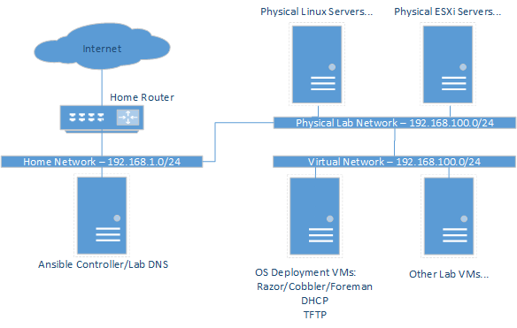

# Repo under construction from a private dev repo that had embedded roles
# Required roles are being migrated into Ansible Galaxy

# Ansible-lab

# Summary

This repo is for the creation and operation of my home lab to practice Ansible, Github, provision other Open Source tools for experimentation and general Linux experience

# Lab Requirements

To boot strap the lab into existence it requires the following:

* A VM or physical server with CentOS 8 installed to be used as the Ansible controller
* A physical hypervisor to host other VMs. I use ESXi, it can be obtained for free from here [https://my.vmware.com/en/web/vmware/evalcenter?p=free-esxi7]
* A web service to host ISOs or binaries for local download and use
* A Lab subnet different and accessable from your main home subnet to avoid issues of the Lab issuing DHCP leases to home devices
* Outbound Internet access from the Lab subnet to obtain packages, binaries and OS updates
* A DNS service that can resolve the lab servers or use the DNSMASQ playbook in this repo to install on the Ansible controller and act as a forwarder outside of the lab environment
* The running of the controller_setup.sh script in this repo on the Ansible controller to install the required components, capture Lab specific variables, capture credentials for the running of the various Ansible roles

# Lab Components and Operation

## Lab Topology



## Ansible Controller Setup

[https://docs.ansible.com/ansible/latest/network/getting_started/basic_concepts.html]

1. Create the controller server as CentOS8
2. Clone this repo
3. Run the controller_setup.sh script with root privs to configure the controller node

```
sudo ./controller_Setup.sh
```

The setup script will ask for several inputs which will get added to the Ansible Controller environment variables and are read by the playbooks to create the lab.

* DNS servers
* Lab domain name e.g. homelab.local
* Lab root password
* Lab user account name
* Lab user account password
* Lab subnet

## Inventory and Vars

The Lab will reference the local repo inventory/ folder to get the host data. The hosts file is split into various logical groups

Vars in inventory/ are split into groups_vars and host_vars folders and named appropriately. These vars will need to be edited to reflect any target system. Items include:

* mgmt_nic: in srv_hw.yaml used in kickstart on physical hardware for the primary NIC in CentOS8
* mgmt_nic: in srv_vms.yaml used in kickstart on ESXi VMs for the primary NIC in CentOS8

## Lab Operation

Ansible will be used to install applications and configuration manage servers within the lab via the use of the roles in this Repo.

A DHCP service is created on the Lab network to avoid issues of the lab interacting with devices at home.
This service will issue leases to only device on the lab sunet and point them at the PXE/TFTP services hosted on the network.

Various Open Source applications will be used to test the deployment of OSs to VMs or physical servers. The OS deployment applications in this repo are:

* Puppetlabs Razor Server
* Cobbler (TODO)
* Foreman (TODO)

## Lab Hosts Naming Conventions

|Prefix|Type|Example|
|---|---|---|
|lvmNUMBER|Linux VM|lvm01|
|lhwNUMBER|Linux Physical Server|lhw01|
|esxNUMBER|ESXi Physical Server|esx01|

## Ansible Interaction with Servers

All servers built using any of the OS provisioning tooling will have a user account created and added to the wheel group in the kickstart files.
The Ansible playbooks are configured to use this user account to SSH to the Lab servers to manage and configure them.
The user name and password are captured during the controller node setup process.

# Lab Repo Structure

Each role has a README describing details on the component or service it is deploying or configuring with links to the source information. Featured Roles are:

* lab_os_config - from nicholasrodriguez.lab_os_config
  * requires ntp from geerlingguy.ntp
* dhcp
* tftp
* postgres
* razor
* razor-add-server
* razor-delete-server
* dnsmasq from bertvv.dnsmasq

# TODO - Future Lab Automation Candidates

- [ ] Improve bootstrap mechanism and capture of vars, update hosts with lab domain
- [ ] Add some sort of CMDB or key/value source to replace reading of variables from environment variables
     * Redis
     * ...
- [ ] Push the roles into Ansible Galaxy
- [ ] Separate the Razor Repo and Task creation from the main playbook into different Roles
- [ ] Separate Razor Server hardening Role from the main Razor server creation role
- [X] Add ESXi server provisioning into Razor
- [ ] Add Ubuntu server provisioning into Razor
- [ ] Add VM creation on ESXi via Ansible
- [ ] Cobbler deployment, configuration and use
- [ ] Foreman deployment, configuration and use
- [ ] rSyslog
- [ ] HAProxy
- [ ] ELK Stack provisioning
